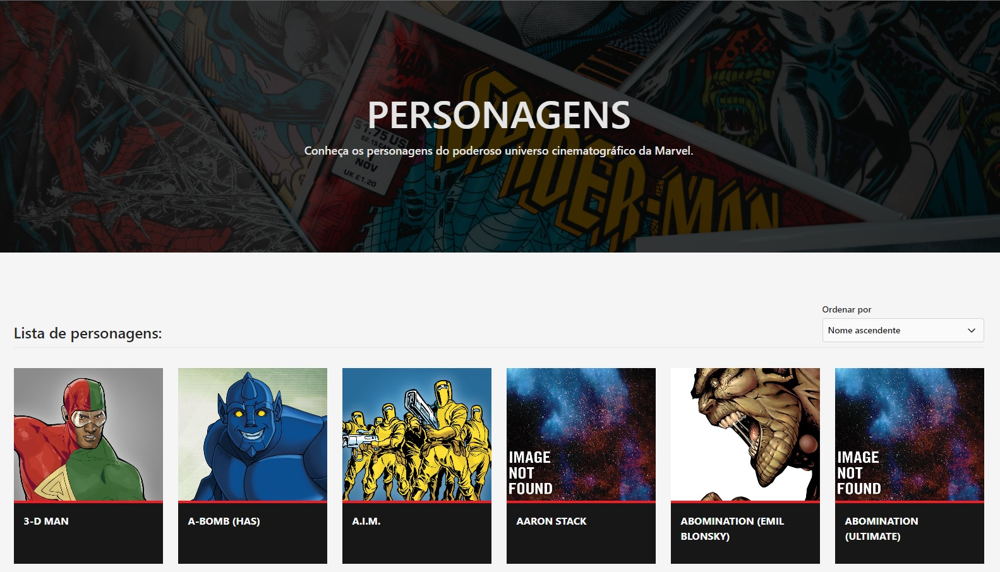

<p align="center">
  
</p>

<p align="center">
  <a href="#-projeto">Projeto</a>&nbsp;&nbsp;&nbsp;|&nbsp;&nbsp;&nbsp;
  <a href="#-tecnologias">Tecnologias</a>&nbsp;&nbsp;&nbsp;|&nbsp;&nbsp;&nbsp;
  <a href="#-como-executar">Como executar</a>&nbsp;&nbsp;&nbsp;|&nbsp;&nbsp;&nbsp;
  <a href="#-licença">Licença</a>
</p>

<p align="center">
  
</p>

<p align="center">
  
</p>

## 💻 Projeto

Esse é um projeto pessoal que fiz, é um site que mostra os personagens, quadrinhos e outras informações do universo Marvel.

## ✨ Tecnologias

As tecnologias utilizadas neste projeto foram:

- [React](https://reactjs.org/)
- [Tailwindcss](https://tailwindcss.com/)
- [Typescript](https://www.typescriptlang.org/)

O projeto também está integrado com a API oficial da Marvel.

## 🚀 Como Executar

- Necessário ter instalado o [Node.js](https://nodejs.org/en/), [Yarn](https://yarnpkg.com/) para executar o projeto.

**Clone o projeto**

```bash
git clone https://github.com/FlavioSant/marvel-website.git
```

**Instale as dependências:**

```bash
yarn install
```

**Executando em modo de desenvolvimento:**

```bash
yarn dev
```

**Gerar build o projeto:**

```bash
yarn build
```

## 📄 Licença

Esse projeto está sob a licença MIT. veja o arquivo [LICENSE](LICENSE) para mais detalhes.

---

By Flávio Santos. :heart:

[](https://www.linkedin.com/in/flavio-santos-75487a164/) [](https://www.instagram.com/flavio_santos_/) [](https://www.facebook.com/flavio.santos.9887)
